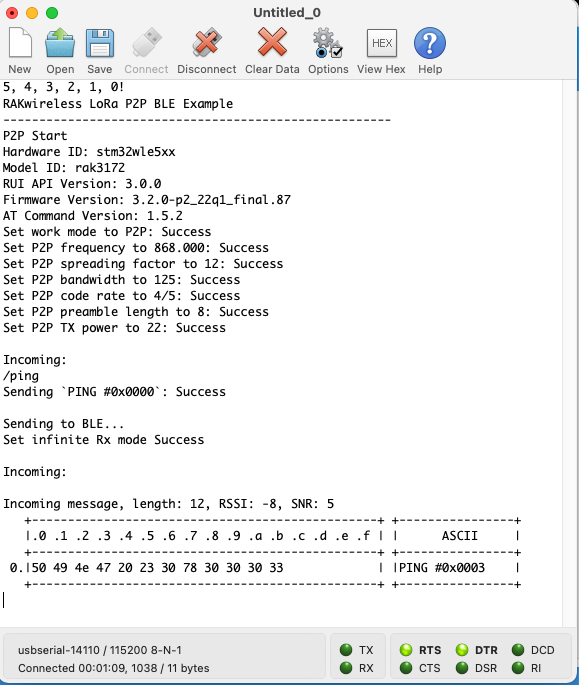
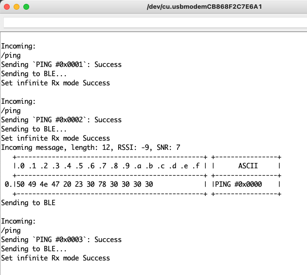

# RUI3_LoRa_P2P_BLE_PING_PONG

A BLE-enabled PING-PONG LoRa P2P sketch for RUI3 / RAK4631 and RAK3172. But but but, you say, the RAK3172 doesn't have BLE?!? Well, then, we will disable it, mah dude! The code relies on a define from the API, `__RAKBLE_H__`, that lets us know whether BLE is available.

A previous version of this sketch was selected as the official `LoRa_P2P` example in the RUI3 BSP. I wanted to add BLE if available, and this is the result.

For the kitchen sink app, see [here](https://github.com/Kongduino/RUI3_LoRa_Kitchen_Sink)...

## RAK3172

## RAK4631

