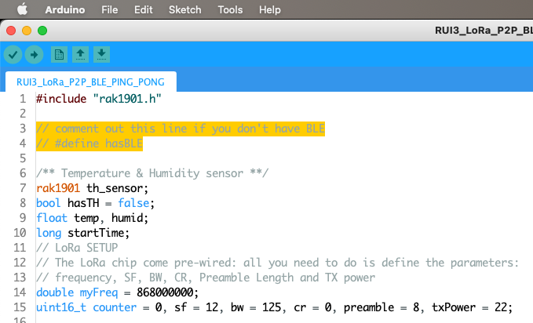
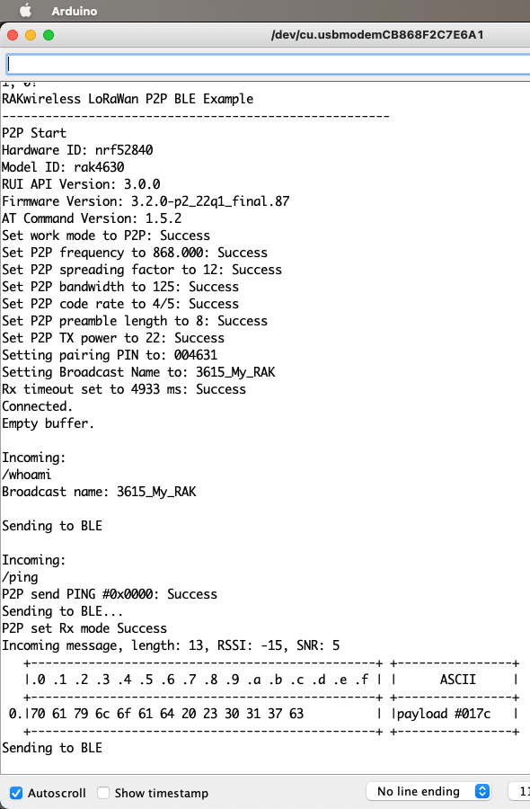
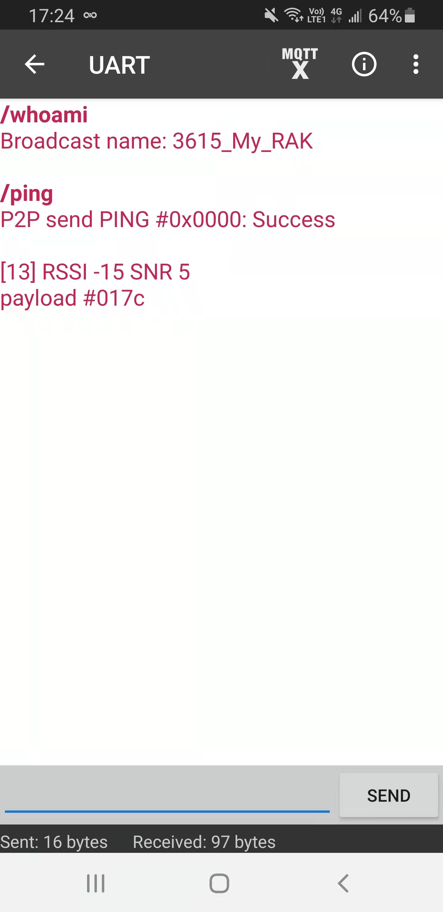
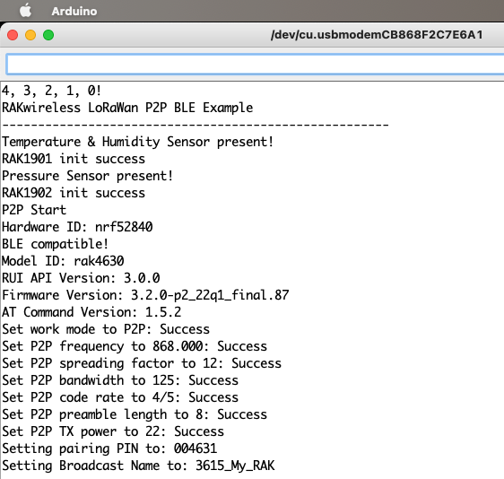

# RUI3_LoRa_P2P_BLE_PING_PONG

A BLE-enabled PING-PONG LoRa P2P sketch for RUI3 / RAK4631 and RAK3172. But but but, you say, the RAK3172 doesn't have BLE?!? Well, then, we will disable it, mah dude! The code relies on a define from the API, `__RAKBLE_H__`, that lets us know whether BLE is available.

It accepts seven commands, via Serial and/or BLE:

* `/whomai`: get the BLE broadcast name. Useful when you have a few devices. You enter this command on Serial, and get the right name.
* `/ping`: self-explanatory I believe...
* `/> xxxxx`: send a custom message. Notice the space between `/>` and `xxxxxx`.
* `/th`: send the temperature and humidity if you have a [RAK1901](https://store.rakwireless.com/products/rak1901-shtc3-temperature-humidity-sensor) connected.
* `/pa`: send the air pressure if you have a [RAK1902](https://store.rakwireless.com/products/rak1902-kps22hb-barometric-pressure-sensor) connected.
* `/lux`: send the Ambient Light level if you have a [RAK1903](https://store.rakwireless.com/products/rak1903-opt3001dnpr-ambient-light-sensor) connected.
* `/bme`: send the temperature, humidity and air pressure if you have a [RAK1906](https://store.rakwireless.com/products/rak1906-bme680-environment-sensor) connected.
⁉️ HPa data seems off by quite a bit, at least on my rak1906...

Yes, the sketch recognizes the sensors on its own.

### UPDATE

I added recognition of an OLED and display, with very smooth scrolling.

